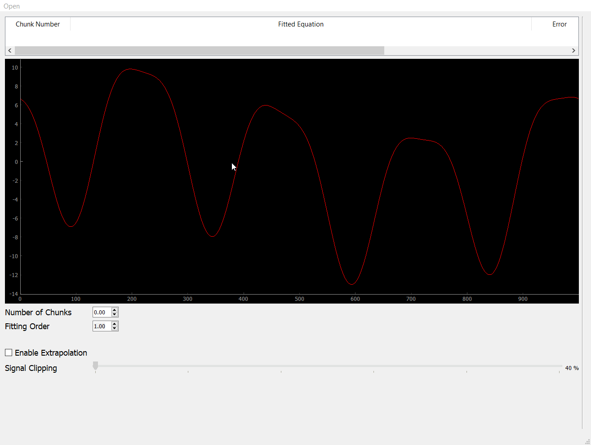

# Curve Fitting & Interpolation Models
- [Description](#Description)
- [Features](#features)
- [Demos](#Demos)
    - [Interpolation](#Interpolation)
    - [Extrapolation Efficacy](#Extrapolation_Efficacy)
    - [Error Map](#Error_Map)
- [Run-App](#Run-App)  
------
## Description
- Curve fitting and interpolation are among the most usable tool in signal processing and  data science. In curve fitting, the given points can be treated as one chunk that fits one polynomial, or small chunks, each to be fit into a different polynomial. The latter is often called spline interpolation. In any interpolation problem, a compromise is often needed between the order of the polynomial (usually, the higher order, the better accuracy) and the computational needs (usually, the higher order, the more exhaustive).
-----
## Features
- The user can open and display an arbitrary signal.
- The user can choose if the fitting to be done as one chunk or multiple ones and control the number of chunks.
- The user can choose the order of the fitting polynomial. 
- The app can display the fitting result in dotted line on the same graph that displays the original signal.
- The app shows The fitted equation and percentage error in mathematical form above the main graph using Latex format.
- The user can generate an error map for the fitting process via clicking a button.
- The user can apply the fitting process on only 50% or 60%,…or 90% of the signal ,the last portion is practically extrapolated.


------
## Demos
### Interpolation

### Extrapolation_Efficacy

### Error_Map


-----


## Run-App
**_Run the application_**
```sh
python main.py
```
